# Round Stall Change Design

Design notebook: [`.design/round-stall/notebook.md`](../../.design/round-stall/notebook.md)
Source discovery: [`docs/discovery/prompted-deep-discovery.md`](../discovery/prompted-deep-discovery.md), finding `f.deadline`

## Executive Summary

**A round in Prompted can stay open forever.** The submission deadline is computed, stored and shown to players, but nothing on the server ever reads it. The only way out of the submission phase is every connected non-Judge player submitting, so one member who never returns holds the round open indefinitely while the interface counts down to zero and then sits there.

The proposed change makes the deadline mean something, **without adding a scheduler**. The server gains one idempotent function — "has this round's deadline passed, and if so, act" — called at the moments the round is already being handled. The client, which already runs a countdown, emits a single nudge when it reaches zero; the server re-checks its own clock and acts only if the deadline genuinely passed.

This seam fits the application for three reasons. The deadline is already an absolute instant persisted inside the group blob, so evaluating it on read is stateless and survives a restart for free. The server has no scheduler today, and adding one would mean adding restart-recovery state — more machinery, not less. And it preserves the posture this codebase takes everywhere: **the server decides, the client asks.**

## Requested Outcome

A round must always be able to finish.

| Scenario | Today | Proposed |
|---|---|---|
| Deadline passes, some submissions arrived | Round stays open forever | Voting opens with the submissions that arrived |
| Deadline passes, nobody submitted | Round stays open forever | Host is told; the round restarts with the **same Judge and same topic** |
| The Judge never picks a topic | Round stays open forever | Host can reassign the Judge |

The zero-submission behavior is a participant decision taken in this session. The non-zero behavior is **inferred** from it and is stated as an assumption in [Decisions](#decisions).

## Relevant Current Behavior

**The deadline is written once and never read.** `select_topic` sets it (`server/server.js:528-530`):

```js
const submissionHours = group.settings.submissionTime || 24;
theme.deadline = new Date(Date.now() + submissionHours * 60 * 60 * 1000).toISOString();
```

No other line in the server reads `theme.deadline`. A search for `setTimeout` and `setInterval` across `server/server.js` returns no matches — **there is no scheduler in the application.**

**The only exit from the submission phase** (`server/server.js:949-951`):

```js
const eligiblePlayers = group.players.filter(p => p.connected !== false && p.userId !== theme.czarId);
if (eligiblePlayers.length > 0 && theme.submissions.length >= eligiblePlayers.length) {
  theme.status = 'voting';
}
```

This counts **connected** players, which is a partial accident of a mitigation: a player who drops off shrinks the bar. It does not help when a player stays connected and never submits, and it does not help when a socket lingers.

**The client counts down to nothing** (`web-app/src/pages/GroupView.jsx:113-131`). A one-second interval computes the remaining time; at zero it sets the display to zero and clears itself. The player watches 00:00 and waits. This is the visible symptom, and it is also the trigger this design will use.

**`topic_selection` has no deadline at all.** `beginRound` sets `deadline: null` with a comment explaining that the clock deliberately starts when the topic is chosen, so time spent choosing is not taken out of the players' submission window. That reasoning is sound and this design does not disturb it — which is why the topic-selection stall gets a different answer.

**The Judge can be offline.** `beginRound` prefers connected players for a random pick, but a host-forced Judge is looked up without any connected check (`server/server.js:158-160`). Only the Judge can leave `topic_selection`.

### Why this went unnoticed

The test suite is green and has been through five consecutive full runs. `game-loop.spec.js:120` asserts the deadline is *truthy* — that it was set — and no test ever waits one out. Every test advances the round by having every player act, which is exactly the path that works.

## Affected Surface

| Area | Change |
|---|---|
| `server/server.js` — new `advanceIfExpired(group)` | New shared responsibility |
| `select_topic` | Unchanged behavior; gains server-side bounds on `submissionTime` |
| `submit_video` | Existing auto-advance kept; expiry checked alongside |
| `get_group`, `join_group`, `start_group`, `start_round` | Become evaluation points |
| New inbound event | The client nudge, behind the existing rate limiter |
| `broadcastGroup` / `group_details` payload | Optional per-player `notice` |
| `web-app/src/pages/GroupView.jsx` | Countdown emits at zero instead of stopping; renders the notice |
| Persisted data | **No schema change.** `deadline` already exists and already persists |
| Tests | Both expiry branches; the existing deadline assertion still holds |

**Deliberately outside scope:** voting, scoring, reveal, history, identity, topics, the YouTube path. `votingTime` is collected by the wizard but inert (discovery finding `f.settings`) and is not addressed here.

## External Findings That Shaped the Design

**Can an in-process timer carry a 24-hour window?** Measured directly on this machine, Node v26.5.0:

```
submissionTime default 24h = 86400000 ms
TIMEOUT_MAX (2^31-1)       = 2147483647 ms  = 24.9 days
24h fits in one setTimeout : true
delay of 2^31 ms           -> _idleTimeout: 1, fires immediately
```

Node emits `TimeoutOverflowWarning` and clamps any delay above 2^31-1 ms to 1 ms.

**How this connects to the application.** Twenty-four hours fits comfortably, and the wizard bounds the field to 168 hours (`web-app/src/pages/CreateGroup.jsx:465-466`). But that bound is `min`/`max` on an HTML input, and **the server never validates `submissionTime`** — `server/server.js:529` reads `group.settings.submissionTime || 24` and trusts it. A crafted `create_group` payload can set any value.

Today that is nearly harmless, because nothing reads the deadline. Under a timer seam it becomes "the round advances the instant it opens" — a worse failure than the one being fixed. This finding **removed an option** rather than creating one, and it surfaced a validation gap the change must close regardless.

## Options and Candidate Seams

### A — A timer per round

Attach in `select_topic`: `setTimeout` for the remaining window.

Rejected. It does not survive a restart, and with a 24-hour default a restart during an ordinary round silently loses the guarantee. Making it durable requires a re-arm sweep at boot — which is option C, plus a scheduler. The unvalidated `submissionTime` makes the overflow above reachable. And it would introduce the first scheduler into a server that has none, for a deadline that is already persisted.

*What would revive it:* submission windows measured in minutes.

### B — A host force-advance control only

A host-only "Close submissions now" button.

Rejected as a solution. It substitutes an absent host for an absent player, and the discovery established that the host role cannot be transferred (`f.host`), so an absent host is both real and unrecoverable. Worth keeping as an addition — see [Remaining Design Questions](#remaining-design-questions).

### C + D — Persisted deadline, evaluated at natural moments, plus a client nudge *(chosen)*

One idempotent check called wherever the round is already handled, completed by a nudge from the countdown that already exists.

Chosen because the deadline is **already** a persisted absolute instant, which makes evaluation-on-read correct across restarts with no new state; because it adds no scheduler; and because the nudge closes the one real gap in evaluation-on-read — everybody sitting on the round view, nobody interacting — without making the client an authority. The server re-checks its own clock, so a skewed or lying client achieves nothing.

## Proposed Delta

### Current → proposed

```mermaid
graph TB
    subgraph now["Today"]
        N1["select_topic<br/>sets theme.deadline"] --> N2["deadline stored<br/>and broadcast"]
        N2 --> N3["client counts down"]
        N3 --> N4["reaches 00:00"]
        N4 --> N5["nothing happens<br/>round open forever"]
    end

    subgraph proposed["Proposed"]
        P1["select_topic<br/>sets theme.deadline<br/>submissionTime now bounded"] --> P2["deadline stored<br/>and broadcast"]
        P2 --> P3["client counts down"]
        P3 --> P4["reaches 00:00<br/>emits one nudge"]
        P4 --> P5["advanceIfExpired<br/>server re-checks its own clock"]
        P6["get_group / join_group /<br/>submit_video / start_round"] --> P5
        P5 --> P7{"submissions?"}
        P7 -->|"one or more"| P8["voting opens"]
        P7 -->|"none"| P9["re-arm: same Judge,<br/>same topic, new deadline<br/>host notified"]
    end

    classDef bad fill:#f2dede,stroke:#a94442,color:#000
    classDef good fill:#dff0d8,stroke:#3c763d,color:#000
    class N5 bad
    class P8,P9 good
```



### The new function

```
advanceIfExpired(group) -> boolean            // did anything change?

  no currentTheme, status is not 'submission', or no deadline   -> false
  Date.now() < Date.parse(deadline)                             -> false

  submissions.length >= 1   -> status = 'voting'                -> true

  submissions.length === 0  -> re-arm in place:
                                 new deadline from settings.submissionTime
                                 czarId, topicId, title all unchanged
                                 currentRound NOT incremented
                                 no history entry written
                                 notice queued for the host     -> true
```

Idempotent by construction: it only acts when the phase is `submission` and the clock has genuinely passed, and every action it takes moves the round out of that condition or pushes the deadline forward. Concurrent callers are safe because the server is single-threaded and `better-sqlite3` writes synchronously.

**Called from** `get_group`, `join_group`, `submit_video`, `start_group`, `start_round`, and the new nudge event. Each caller persists and broadcasts only when it returns `true`.

### Contracts

- One new inbound event carrying only a group id. It runs behind the existing token-bucket rate limiter and crash guard like every other handler.
- `group_updated` and `group_details` gain an **optional** per-player `notice`. `broadcastGroup` already builds a per-player payload (`isRoundLeader`, `yourSubmissionId`), so this uses an existing seam rather than adding a channel.
- No existing field changes shape.

### Data

**No schema change.** `deadline` already exists on `currentTheme` and already persists inside the group blob. The re-arm overwrites it in place.

### Also required

`submissionTime` must be validated server-side to 1-168 hours on both `create_group` and `update_group`, exactly as `overrideThreshold` already is (`server/server.js:143-145`). Without it, the re-arm can be handed an absurd window. The existing `overrideThreshold` treatment is the pattern to copy — though note the discovery found that path is itself inconsistent (silently corrected on create, rejected on update; finding `f.threshold`), so copy the **rejecting** branch.

### Scenario 3, handled separately

Allow the host to reassign the Judge while the round is in `topic_selection`, reusing the existing Pick Judge modal and the `czarUserId` argument `start_round` already accepts.

This deliberately introduces **no clock** into `topic_selection`. The comment at `server/server.js:178-180` explains why that phase has no deadline — time spent choosing should not come out of the players' submission window — and that reasoning still holds. A stalled topic selection is a "wrong person holds the role" problem, not a timing problem, so it gets a role fix.

## Transition and Coexistence

None required. No old and new behavior need to overlap: there is no existing expiry behavior to preserve, no data migration, and no contract removed. Rounds already in flight when the change deploys pick up the new behavior at the next evaluation point, because the check reads a persisted absolute instant that is already correct.

## Decisions

| Decision | Choice | Confidence | Reason to reopen |
|---|---|---|---|
| Seam | Persisted deadline evaluated at natural moments, plus a client nudge | High | Submission windows drop to minutes, making a timer reasonable |
| Zero-submission behavior | Notify the host; re-arm with the same Judge and topic | High — participant decision this session | The host would rather cancel the round |
| **Non-zero behavior** | **Advance to voting with what arrived** | **Medium — inferred, not stated** | **The participant intended a re-arm in both cases** |
| Is a re-arm the same round? | Yes: no round increment, no history entry | Medium | Each attempt should appear in history |
| Topic-selection stall | Host reassigns the Judge; no clock added | Medium | Groups report stalling before submissions open |
| `submissionTime` validation | Add server-side bounds of 1-168 hours | High | — |

The one to watch is the third. The participant answered the zero-submission case explicitly and did not state the non-zero case; advancing with what arrived is the reading that makes the answer coherent, but it is an inference and is called out here rather than buried.

## Research and Prototype Findings

The Node timer measurement above is the only external finding that changed the design. It eliminated seam A and surfaced the missing `submissionTime` validation, which is now part of the change. No prototype was needed: the uncertainty separating the seams was a platform fact, resolvable by measurement in under a minute.

## Remaining Design Questions

1. **Should a re-arm repeat forever?** As designed, a round with no submissions re-arms every window indefinitely, notifying the host each time. A cap, or a host-initiated cancel, may be wanted. Nothing in the application can cancel a round today. *Needs participant judgment.*
2. **Should the host be able to close submissions early?** Cheap to add on this seam and independently useful, but not required by any of the three scenarios. *Needs participant judgment.*
3. **Does the notice need to persist?** A host who was offline when the round restarted will not receive a notice delivered only on broadcast. Delivering it on next connect would require storing it on the group. *Needs participant judgment.*

None of the three change the seam, and the design is coherent without them.
