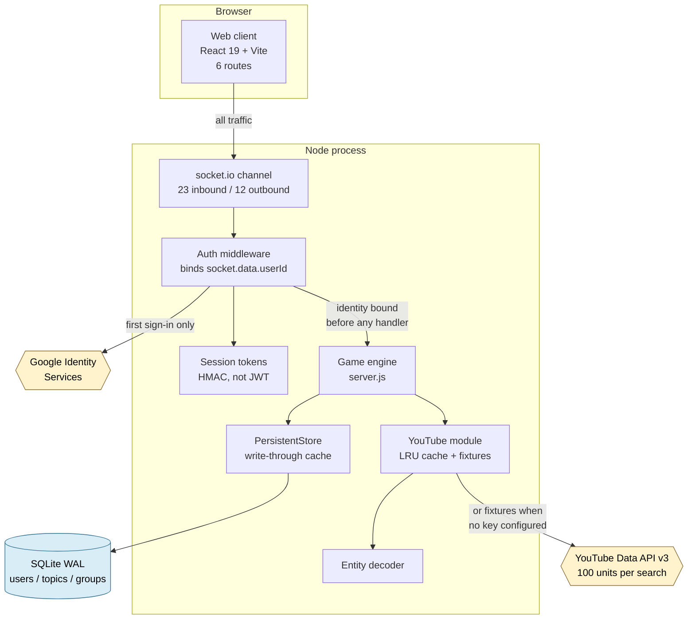
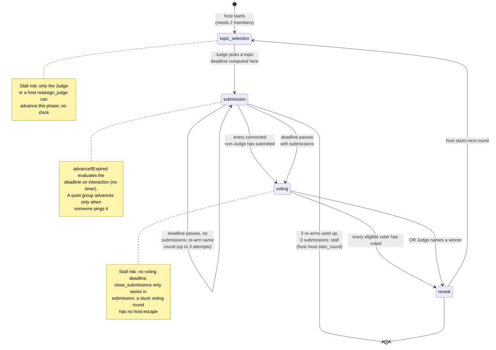
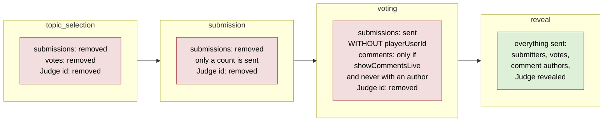
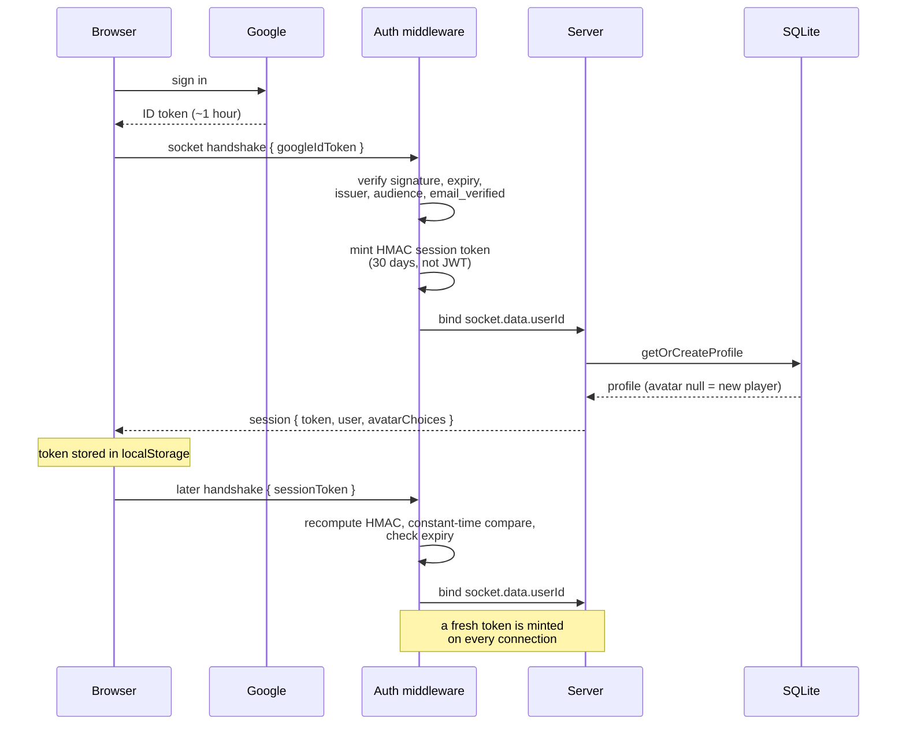

# Prompted Architecture Atlas

Derived from [application-model.json](../knowledge-base/application-model.json) at revision `cfa08f6`. Every view below projects entries from that model; the model is the authority, this page is the explanation.

**Rendering note.** No Mermaid CLI or Graphviz was available in this environment, and the discovery method forbids installing one. Diagram sources are published here and as `.mmd` files beside this page. They render in GitHub and any Mermaid-aware viewer. **They were not visually inspected**, so labels may need adjusting when first rendered.

Four views are published. Prompted is a two-process application, so a single combined system-and-runtime view stays legible; the other three answer questions that view cannot.

| View | Reader question | Source |
|---|---|---|
| [System and runtime](#1-system-and-runtime) | What are the moving parts, and which are outside our control? | `system-runtime.mmd` |
| [Round lifecycle](#2-round-lifecycle) | How does a round advance, and where can it get stuck? | `round-lifecycle.mmd` |
| [Concealment through a round](#3-concealment-through-a-round) | Who is allowed to know what, and when? | `round-concealment.mmd` |
| [Identity and trust](#4-identity-and-trust) | How does a visitor become someone the server will act for? | `identity-trust.mmd` |

No module-dependency view is published. The application is small enough that its import graph explains nothing the system view does not, and the guide warns against publishing a raw symbol graph as architecture.

---

## 1. System and runtime

Two processes, one database file, two external services. The client holds no game rules; every decision is made server-side and broadcast.

**What this view establishes.** There is no REST API for gameplay — socket.io carries everything. The auth middleware sits between the channel and every handler, which is what makes host-only and Judge-only rules enforceable rather than advisory. Both external services have a defined absence behavior: Google missing disables sign-in outside production and is fatal in production; YouTube missing falls back to fixtures transparently.

Support: static analysis. No runtime topology was observed — this is the structure the code establishes, not a deployment that was watched.

---

## 2. Round lifecycle

The core domain object. A round lives on `group.currentTheme` and moves through four phases.

**What this view establishes.** Every transition is driven by a player action or by `advanceIfExpired` reading a stored deadline at an interaction moment (`server/server.js:198-238`, evaluated at join `:805`, group read `:852`, submit `:1203`, and the client `check_round_deadline` nudge `:872-882`). There is deliberately **no scheduler**: the deadline persists on the theme and is enforced on the next interaction, not by a background timer.

The submission phase is no longer the permanent stall it once was (`f.deadline`): with zero submissions a round restarts the *same* round — same Judge, same topic, `currentRound` not incremented, no history entry — up to `MAX_AUTO_REARMS` (3) attempts, then stalls for the host, who alone can `start_round` it again. With submissions it advances to voting with what arrived. Two real stalls remain: the voting phase has no deadline and no host escape (`close_submissions` only works during submission), and topic selection has no clock, only the host-only `reassign_judge`.

Support: static analysis (`server/server.js:198-238`, `:595-644`, `:905-969`), demonstrated by test (`web-app/e2e/round-deadline.spec.js`).

---

## 3. Concealment through a round

Prompted is a judging game, so who knows what, and when, is the product. This is enforced by removing fields from the broadcast payload, not by hiding them in the interface.

**What this view establishes.** A modified client cannot reveal what it was never sent. `publicizeTheme` strips `czarId` from every broadcast in every phase before reveal, and during voting it rebuilds each submission without its author. Comments are collected always but leave the server mid-round only when the host opted in, and even then carry no author and are ordered by submission so the ordering itself leaks nothing.

This is verified rather than assumed: a test asserts the Judge's id appears in no websocket frame before reveal, checking wire traffic rather than the DOM.

Support: demonstrated by test (`web-app/e2e/game-loop.spec.js`) over static analysis (`server/server.js:286-330`).

---

## 4. Identity and trust

**What this view establishes.** Identity is proved once per connection and then carried in server memory. No handler ever reads a user id from a message payload, which is the property that makes every authorization rule real.

Two things a reader should carry away. First, the session token exists because a Google ID token expires in about an hour, far too short for a reconnect pattern — this is a deliberate, documented choice, as is the decision not to use JWT. Second, **there is no revocation path**: no record of issued tokens exists, signing out clears local state only, and a fresh token is minted on every connection, so an active session renews indefinitely (`f.norevoke`).

Support: static analysis (`server/auth.js`, `server/session.js`, `server/config.js`). The live Google path is never exercised by the test suite, by design, so it is not confirmed working here.

---

## Cross-boundary notes

- **The client mirrors two server constants rather than importing them.** `MIN_PLAYERS_TO_START` exists in both, and the client's copy carries a comment saying it mirrors the server. This keeps the UI honest about what the server will accept, at the cost of a value that must be changed in two places.
- **Player records carry two identities.** The server sends both a transient socket `id` and a stable `userId`; the client's `mapPlayers` collapses these, remapping `id` to the stable identity so nothing downstream can accidentally compare against a socket id.
- **Settings cross the boundary as an opaque object.** The client sends 21 keys; the server validates two (`submissionTime` to 1–168h, `overrideThreshold` to 51–100) and reads nine. The rest are stored and echoed back without comment, which is how the inert settings became invisible (`f.settings`).
